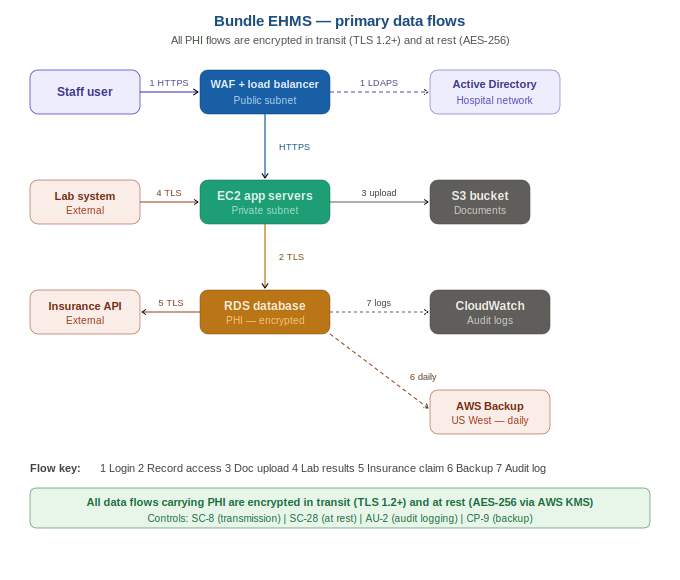

# Data Flow Description

---

## Purpose

This document describes how data — particularly Protected
Health Information (PHI) — flows through the Bundle EHMS
system. Understanding data flows is essential for:

- Identifying where PHI is at risk
- Ensuring encryption is applied at every transmission point
- Meeting HIPAA requirements to document PHI movement
- Supporting the system boundary definition

See the data flow diagram image in this folder for a visual
representation of these flows.

---

## Encryption Baseline

Every data flow in Bundle that carries PHI or PII uses
encryption. This is a non-negotiable requirement.

**In transit:** All connections use TLS 1.2 or higher.
TLS 1.0 and 1.1 are disabled at the load balancer.

**At rest:** All databases and storage use AES-256
encryption via AWS KMS with customer-managed keys.

---

## The Seven Primary Data Flows

### Flow 1 — Staff Login and Authentication

**What happens:**
A staff member opens Bundle in their browser and enters
their username and password. The browser sends these
credentials over HTTPS to the AWS WAF, which filters
the request, then passes it to the Application Load
Balancer, which forwards it to an EC2 application server.
The application server sends the credentials to Amazon
Cognito for verification. If the password is correct,
Cognito requests an MFA code. The user enters their
6-digit TOTP code. Cognito verifies it and issues a
session token back to the application server, which
sends it to the browser as a secure cookie.

**Data involved:** Username, hashed password, MFA code,
session token (no PHI at this stage)

**Path:** Browser → WAF → Load Balancer → EC2 → Cognito → EC2 → Browser

**Encryption:** HTTPS/TLS 1.2+ end to end

---

### Flow 2 — Patient Record Access

**What happens:**
A logged-in doctor or nurse clicks on a patient record.
The browser sends a request with the session token to
the load balancer. The EC2 application server validates
the session token and checks the user's role (via IAM
and Cognito). If the user has the right role, the
application server queries the RDS PostgreSQL database
for the patient record. The database returns the
encrypted data. The application server formats it and
sends it back to the browser over HTTPS.

**Data involved:** Session token, patient ID, full PHI
record including diagnoses, medications, clinical notes

**Path:** Browser → WAF → Load Balancer → EC2 → RDS → EC2 → Load Balancer → Browser

**Encryption:** HTTPS in transit, AES-256 at rest in RDS

**Audit event generated:** Record access logged to CloudWatch
with timestamp, user ID, patient ID, and access type

---

### Flow 3 — Document Upload (Medical Images, PDFs)

**What happens:**
A clinician uploads a medical document such as a scan
result or referral letter. The browser sends the file
over HTTPS to the load balancer. The EC2 application
server receives the file, validates it (file type
checking, malware scan), generates a unique encrypted
S3 key, and uses the AWS SDK to upload the file to
the S3 bucket. S3 stores the file with server-side
encryption using KMS. A reference to the S3 object
is stored in the RDS database linked to the patient record.

**Data involved:** PHI — medical document potentially
containing diagnoses, scan results, clinical assessments

**Path:** Browser → WAF → Load Balancer → EC2 → S3 (stored encrypted)

**Encryption:** HTTPS in transit, SSE-KMS at rest in S3

---

### Flow 4 — Laboratory Results Arriving

**What happens:**
An external laboratory sends test results for a patient
directly to Bundle via an HL7 API endpoint. The request
arrives at the WAF, passes through the load balancer
to the API server, which validates the HL7 message
format and the sending system's API credentials. The
validated result is written to the RDS database and
linked to the patient record. A notification is generated
for the requesting clinician.

**Data involved:** PHI — laboratory test results
(blood tests, pathology, microbiology)

**Path:** Laboratory System → WAF → Load Balancer → EC2 API Server → RDS

**Encryption:** TLS 1.2+ in transit, AES-256 at rest in RDS

**Authentication:** Lab system authenticates using a
service account API key managed in AWS Secrets Manager

---

### Flow 5 — Insurance Claim Submission

**What happens:**
The billing team processes a claim. The EC2 application
server retrieves the relevant patient and treatment data
from RDS, formats it into the required insurance claim
format (CMS-1500 equivalent), and transmits it via HTTPS
to the insurance company's API endpoint. The response
(approval, rejection, or request for more information)
is received and stored in RDS.

**Data involved:** PHI subset — treatment codes, dates
of service, provider information, patient insurance ID

**Path:** EC2 → Insurance API → EC2 → RDS

**Encryption:** TLS 1.2+ in transit, AES-256 at rest in RDS

---

### Flow 6 — Automated Daily Backup

**What happens:**
Every night at 01:00 AWS Backup initiates an automated
backup of the RDS database. The backup is encrypted
with the same KMS key as the primary database and
stored in the S3 backup bucket in US East. A copy is
replicated automatically to the S3 DR bucket in US West
for disaster recovery purposes.

**Data involved:** Full copy of all PHI and operational
data in the database

**Path:** RDS → AWS Backup → S3 (US East) → S3 Replication → S3 (US West)

**Encryption:** AES-256 at all stages using KMS keys

---

### Flow 7 — Audit Log Transmission

**What happens:**
Every action on every EC2 instance generates an audit
event. These events are streamed in near-real-time to
AWS CloudWatch Logs. AWS CloudTrail separately captures
every AWS API call made in the account. Both streams
feed into AWS Security Hub for consolidated monitoring.
After 90 days, CloudWatch logs are exported to the S3
audit archive bucket with S3 Object Lock enabled to
prevent deletion.

**Data involved:** Audit metadata — user IDs, action
types, timestamps, resource IDs (no raw PHI in logs)

**Path:** EC2 → CloudWatch → Security Hub (real-time)
CloudWatch → S3 Audit Archive (after 90 days)

**Encryption:** CloudWatch logs encrypted at rest,
S3 archive encrypted with KMS

---

## Data Flow Diagram

The visual representation of all seven flows is shown below.

---

## PHI Data Store Inventory

| Store | Type | Data Held | Encryption |
|-------|------|-----------|-----------|
| RDS PostgreSQL | Relational database | Patient records, PHI, PII, billing | AES-256 KMS CMK |
| S3 Documents | Object storage | Medical documents and images | SSE-KMS |
| S3 Backup | Object storage | Full database backup | AES-256 KMS CMK |
| S3 DR (US West) | Object storage | Cross-region backup | AES-256 KMS CMK |
| CloudWatch Logs | Log storage | Audit metadata only — no raw PHI | CloudWatch KMS encryption |

---

*This document is part of the Bundle RMF portfolio project.
All names, data, and scenarios are fictional and used for
learning and career development purposes only.*

