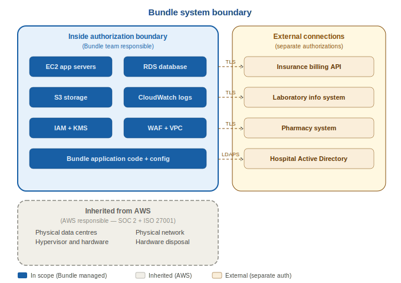

# System Boundary

**System:** Bundle — Electronic Healthcare Management System
**Document:** System Boundary Definition
**Step:** Step 1 — Categorize
**Version:** 1.0
**Prepared By:** James Okafor, ISSO
**Date:** 2025

---

## What is a System Boundary?

The system boundary defines exactly what is included within the scope
of this RMF authorisation. Components inside the boundary are subject
to all security controls selected for Bundle. Components outside the
boundary are governed by separate authorizations or inherited controls.

---

## Components Inside the System Boundary

The following components are within scope. Bundle's team is responsible
for implementing and maintaining security controls for all of these:

| Component | Type | Details |
|-----------|------|---------|
| EC2 application servers | Compute | Two instances running Bundle web application. Amazon Linux 2023. Auto-scaling group. |
| EC2 API servers | Compute | Two instances running Bundle REST API. Amazon Linux 2023. |
| RDS PostgreSQL database | Database | Primary and standby instances. Multi-AZ. Stores all PHI and operational data. |
| S3 document storage | Storage | Medical documents and images. Versioning enabled. Server-side encryption. |
| AWS CloudWatch | Logging | All application and infrastructure logs. 90-day retention. |
| AWS IAM | Access Control | All user accounts, roles, and policies for Bundle. |
| AWS KMS | Encryption | Customer-managed keys for all Bundle encryption. Annual rotation. |
| AWS VPC | Networking | Dedicated virtual network. Public and private subnets. |
| AWS WAF | Perimeter | Web application firewall protecting public endpoints. |
| AWS Security Groups | Firewall | Virtual firewalls controlling traffic between components. |
| Bundle application code | Software | All custom code, configuration files, and deployment scripts. |
| Bundle user accounts | Identity | All 500 user accounts and their credentials. |
| AWS Backup | Backup | Daily automated backups. Cross-region replication to US West. |

---

## Components Outside the Boundary — Inherited from AWS

The following are outside Bundle's direct control. AWS is responsible
for these under the AWS Shared Responsibility Model. Evidence of AWS
compliance is retained in the evidence/aws-compliance/ folder.

| Component | AWS Responsibility | Evidence |
|-----------|------------------|---------|
| Physical data centre security | Facility access, environmental controls, hardware security | AWS SOC 2 Type II Report |
| Hypervisor and virtualisation | Isolation between different customers virtual machines | AWS Shared Responsibility documentation |
| Physical network infrastructure | AWS backbone and regional connectivity | AWS ISO 27001 Certificate |
| Hardware maintenance and disposal | Physical hardware lifecycle management | AWS SOC 2 Type II Report |

---

## Third-Party Connections

The following external systems connect to Bundle. These connections
are in scope for security review but the third-party systems themselves
are governed by their own security authorizations:

| System | Direction | Protocol | Agreement |
|--------|-----------|----------|-----------|
| Insurance Company Billing API | Outbound | TLS 1.2+ mutual authentication | Vendor contract + BAA |
| Laboratory Information System | Bidirectional | HL7 FHIR over TLS | Vendor BAA |
| Pharmacy Management System | Bidirectional | API over TLS | Vendor BAA |
| Hospital Active Directory | Inbound authentication | LDAPS | Internal IT agreement |

---

## Boundary Diagram Reference

See the system boundary diagram in this folder:

---

## What is NOT Included

The following are explicitly outside the scope of this authorisation:

- The third-party systems listed above — they have their own security programmes
- AWS physical infrastructure — covered by AWS compliance certifications
- Hospital internal network infrastructure beyond the VPN connection point
- Personal devices belonging to staff — only hospital-managed devices are permitted

---

## Document Version History

| Version | Date | Author | Changes |
|---------|------|--------|---------|
| 1.0 | 2025 | James Okafor | Initial boundary definition completed |

---

*This document is part of the Bundle RMF portfolio project.
All names, data, and scenarios are fictional and used for
learning and career development purposes only.*

