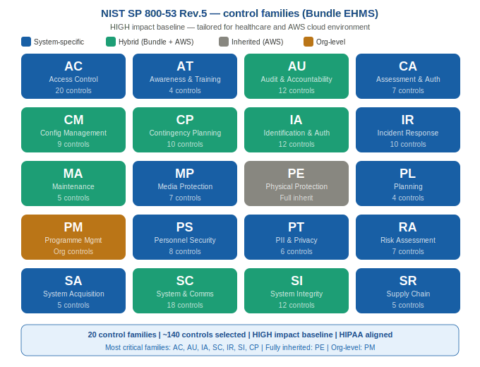
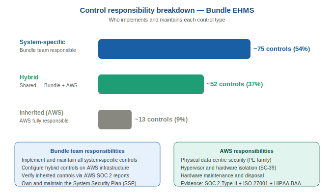

# Step 2 — Select

---

## What is the Select Step?

Now that Bundle is formally categorised as a **HIGH impact system**, the Select step chooses which security controls will protect it.

Security controls are the specific safeguards — policies, technical settings, and procedures — that reduce risk. NIST SP 800-53 Rev. 5 provides a catalogue of over 1,000 controls across 20 families. This step:

1. Starts with the **HIGH impact baseline** — the pre-defined set of controls NIST recommends for high-sensitivity systems
2. **Tailors** that baseline to fit Bundle's healthcare and AWS cloud environment
3. Assigns a **named owner** to every control
4. Begins the **System Security Plan (SSP)** — the master document for the entire RMF programme

> The SSP starts here and is completed in Step 3. It is the single most important document in the RMF process — the primary thing the Authorizing Official reads when deciding whether to issue the ATO.

---

## Documents in This Folder

| File | Description |
|------|-------------|

| File | Description |
|------|-------------|
| [README.md](README.md) | This file — overview of the Select step |
| [control-selection.md](control-selection.md) | All 20 NIST 800-53 control families with tailoring decisions |
| [tailoring-decisions.md](tailoring-decisions.md) | Detailed justification for every tailoring decision |
| [inherited-controls.md](inherited-controls.md) | AWS inherited controls with evidence sources |
| [control-responsibility-matrix.md](control-responsibility-matrix.md) | RACI for all controls |
---

## Control Selection Approach

| Stage | Action |
|-------|--------|
| **Stage 1** | Start with the HIGH impact baseline from NIST SP 800-53B |
| **Stage 2** | Tailor — add, remove, or modify controls for Bundle's context |
| **Stage 3** | Classify each control as System-Specific, Inherited (AWS), or Hybrid |

### Control Types Explained

| Type | Meaning | Example for Bundle |
|------|---------|-------------------|
| **System-Specific** | Implemented entirely by Bundle's team | AC-2 — Bundle's team manages all user accounts |
| **Inherited** | Implemented by AWS under Shared Responsibility Model | PE-3 — AWS controls physical data centre access |
| **Hybrid** | Split between Bundle's team and AWS | IA-2 — AWS Cognito provides MFA; Bundle's team enforces the policy |

---

## Selected Controls by Family

### AC — Access Control

| Control | Name | Type | Owner |
|---------|------|------|-------|
| AC-1 | Access Control Policy | System-Specific | James Okafor (ISSO) |
| AC-2 | Account Management | System-Specific | James Okafor (ISSO) |
| AC-3 | Access Enforcement (RBAC) | Hybrid | Priya Nair (ISSE) |
| AC-6 | Least Privilege | System-Specific | Priya Nair (ISSE) |
| AC-7 | Unsuccessful Login Attempts (5 attempts → 30 min lockout) | System-Specific | Priya Nair (ISSE) |
| AC-11 | Session Lock (15 min inactivity) | System-Specific | Priya Nair (ISSE) |
| AC-17 | Remote Access (VPN + MFA for admin) | System-Specific | James Okafor (ISSO) |
| AC-22 | Publicly Accessible Content | System-Specific | James Okafor (ISSO) |

---

### AU — Audit and Accountability

| Control | Name | Type | Owner |
|---------|------|------|-------|
| AU-1 | Audit Policy | System-Specific | James Okafor (ISSO) |
| AU-2 | Event Logging | Hybrid | Priya Nair (ISSE) |
| AU-3 | Content of Audit Records (timestamp, user ID, IP, outcome) | Hybrid | Priya Nair (ISSE) |
| AU-6 | Audit Record Review (weekly by ISSO) | System-Specific | James Okafor (ISSO) |
| AU-9 | Audit Record Protection | Hybrid | Priya Nair (ISSE) |
| AU-11 | Audit Record Retention (90 days active + 12 months archive) | System-Specific | James Okafor (ISSO) |
| AU-12 | Audit Record Generation | Hybrid | Priya Nair (ISSE) |

---

### IA — Identification and Authentication

| Control | Name | Type | Owner |
|---------|------|------|-------|
| IA-1 | IA Policy | System-Specific | James Okafor (ISSO) |
| IA-2 | MFA for all users (AWS Cognito TOTP) | Hybrid | Priya Nair (ISSE) |
| IA-2(1) | Hardware MFA for privileged accounts | Hybrid | Priya Nair (ISSE) |
| IA-2(2) | Software MFA for standard accounts | Hybrid | Priya Nair (ISSE) |
| IA-4 | Identifier Management (unique, non-reused IDs) | System-Specific | James Okafor (ISSO) |
| IA-5 | Password Management (14 chars min, 90 day expiry, 24 history) | System-Specific | James Okafor (ISSO) |
| IA-8 | Non-Organisational Users (time-limited vendor accounts) | System-Specific | James Okafor (ISSO) |

---

### SC — System and Communications Protection

| Control | Name | Type | Owner |
|---------|------|------|-------|
| SC-1 | SC Policy | System-Specific | James Okafor (ISSO) |
| SC-7 | Boundary Protection (VPC, private subnets, WAF) | Hybrid | Priya Nair (ISSE) |
| SC-8 | Transmission Encryption (TLS 1.2+ enforced) | System-Specific | Priya Nair (ISSE) |
| SC-12 | Cryptographic Key Management (AWS KMS, annual rotation) | Hybrid | Priya Nair (ISSE) |
| SC-13 | Cryptographic Protection (FIPS 140-2, AES-256) | Hybrid | Priya Nair (ISSE) |
| SC-28 | Data at Rest Encryption (RDS + S3 + EBS via KMS) | Hybrid | Priya Nair (ISSE) |
| SC-39 | Process Isolation | Inherited | AWS |

---

### IR — Incident Response

| Control | Name | Type | Owner |
|---------|------|------|-------|
| IR-1 | IR Policy | System-Specific | James Okafor (ISSO) |
| IR-2 | IR Training (annual for all staff) | System-Specific | James Okafor (ISSO) |
| IR-4 | Incident Handling (NIST IR lifecycle) | System-Specific | James Okafor (ISSO) |
| IR-5 | Incident Monitoring (tracked in POA&M) | System-Specific | James Okafor (ISSO) |
| IR-6 | Incident Reporting (1hr to ISSO; 60 days for HIPAA breach to HHS) | System-Specific | James Okafor (ISSO) |
| IR-8 | Incident Response Plan (annual test; ransomware, PHI breach playbooks) | System-Specific | James Okafor (ISSO) |

---

### SI — System and Information Integrity

| Control | Name | Type | Owner |
|---------|------|------|-------|
| SI-1 | SI Policy | System-Specific | James Okafor (ISSO) |
| SI-2 | Flaw Remediation (AWS Inspector; Critical: 15 days, High: 30 days) | System-Specific | Priya Nair (ISSE) |
| SI-3 | Malware Protection (CrowdStrike Falcon EDR) | System-Specific | Priya Nair (ISSE) |
| SI-4 | System Monitoring (CloudWatch + AWS GuardDuty ML detection) | Hybrid | Priya Nair (ISSE) |
| SI-5 | Security Alerts (AWS SNS to ISSO via email + SMS) | Hybrid | James Okafor (ISSO) |
| SI-10 | Input Validation (server-side; prevents SQLi and XSS) | System-Specific | Priya Nair (ISSE) |

---

### CP — Contingency Planning

| Control | Name | Type | Owner |
|---------|------|------|-------|
| CP-1 | CP Policy | System-Specific | James Okafor (ISSO) |
| CP-2 | Contingency Plan (RTO: 4hrs, RPO: 24hrs) | System-Specific | James Okafor (ISSO) |
| CP-4 | Contingency Plan Testing (annual tabletop; DR test every 2 years) | System-Specific | James Okafor (ISSO) |
| CP-9 | System Backup (daily RDS backups; 35-day retention; cross-region) | Hybrid | Priya Nair (ISSE) |
| CP-10 | System Recovery (AWS CloudFormation IaC; tested runbook) | Hybrid | Priya Nair (ISSE) |

---

### All 20 Control Families — Summary

| Family | Coverage |
|--------|----------|
| AC — Access Control | 20 controls selected |
| AT — Awareness and Training | 4 controls — annual training all staff |
| AU — Audit and Accountability | 12 controls selected |
| CA — Assessment, Authorisation and Monitoring | 7 controls selected |
| CM — Configuration Management | 9 controls — AWS Config + golden AMIs |
| CP — Contingency Planning | 10 controls selected |
| IA — Identification and Authentication | 12 controls selected |
| IR — Incident Response | 10 controls selected |
| MA — Maintenance | 5 controls — AWS handles hardware; team handles software patches |
| MP — Media Protection | 7 controls — S3 encryption + secure deletion |
| PE — Physical and Environmental Protection | **Fully Inherited from AWS** |
| PL — Planning | 4 controls — SSP + Rules of Behaviour |
| PM — Programme Management | Org-level — covered by organisation security programme |
| PS — Personnel Security | 8 controls — background checks + termination procedures |
| PT — PII Processing and Transparency | 6 controls — HIPAA privacy compliance |
| RA — Risk Assessment | 7 controls selected |
| SA — System and Services Acquisition | 5 controls — secure SDLC + vendor reviews |
| SC — System and Communications Protection | 18 controls selected |
| SI — System and Information Integrity | 12 controls selected |
| SR — Supply Chain Risk Management | 5 controls — vendor risk + BAAs |

---

## Tailoring Decisions

| Control | Decision | Reason |
|---------|----------|--------|
| AC-2(4) | **ADDED** — Automated account disabling | PHI risk from former employees retaining access |
| AC-11(1) | **ADDED** — Pattern-hiding on session lock | Shared clinical workstations require content hiding, not just locking |
| IA-2(6) | **ADDED** — Separate device for admin MFA | Prevents single compromised device from bypassing MFA |
| MA-3 | **REMOVED** — Physical maintenance tools | Not applicable — fully cloud-hosted; AWS responsibility |
| PE-1 through PE-20 | **INHERITED** — All physical controls | AWS SOC 2 + ISO 27001 cover all physical environment controls |
| SC-28(1) | **ADDED** — Mandatory encryption at rest | HIPAA requires PHI encryption at rest; mandatory for Bundle |
| SI-4(2) | **ADDED** — Automated threat detection (GuardDuty) | ML-based detection essential given HIGH ransomware risk in healthcare |
| PT-2 | **ADDED** — PII processing controls | HIPAA requires explicit controls on PHI/PII collection and use |

---

## Inherited Controls from AWS

AWS provides compliance documentation covering all inherited controls:

- **AWS SOC 2 Type II Report** — independent audit of security and availability controls
- **AWS ISO 27001 Certificate** — international information security standard
- **AWS HIPAA Business Associate Agreement (BAA)** — HIPAA compliance confirmation
- **AWS Shared Responsibility Model** — defines AWS vs. Bundle team responsibilities

| Inherited Control | AWS Responsibility |
|-------------------|-------------------|
| PE-3 — Physical Access Control | Biometrics, badges, security staff at all data centres |
| PE-6, PE-8 — Environmental Protection | Fire suppression, temperature, power redundancy |
| MA-2, MA-3 — Hardware Maintenance | Hardware installation, maintenance, secure disposal |
| SC-39 — Process Isolation | Hypervisor isolation between customers |
| MP-6 — Media Protection | Secure wipe and destruction of storage media |

---

## System Security Plan (SSP) — Draft Status

| SSP Section | Content | Status |
|-------------|---------|--------|
| 1 — System Information | Name, identifier, categorization, owner, ISSO, AO | ✅ Complete |
| 2 — System Purpose and Description | Functions, users, data handled | ✅ Complete |
| 3 — System Environment | AWS architecture, network, data flows | ✅ Complete |
| 4 — System Boundary | In-scope, inherited, third-party connections | ✅ Complete |
| 5 — Applicable Laws | HIPAA, HITECH, NIST publications | ✅ Complete |
| 6 — Control Implementation Statements | How each control is implemented | 🔄 Draft — completed in Step 3 |
| 7 — Roles and Responsibilities | All RMF roles with named individuals | ✅ Complete |
| 8 — Interconnections | Third-party system connections | ✅ Complete |
| 9 — Information Types and FIPS 199 | Data types and impact ratings | ✅ Complete |
| 10 — Control Selection and Tailoring | Selected controls and tailoring | ✅ Complete |

---

## Select Step Checklist

| Task | NIST Task ID | Status |
|------|-------------|--------|
| HIGH baseline identified | S-1 | ✅ Complete |
| Controls selected across all 20 families | S-2 | ✅ Complete |
| Tailoring decisions documented with justification | S-3 | ✅ Complete |
| Each control classified as system-specific, inherited, or hybrid | S-4 | ✅ Complete |
| Named owner assigned to every control | S-5 | ✅ Complete |
| Inherited controls documented with AWS evidence sources | S-6 | ✅ Complete |
| SSP draft structure established | S-7 | ✅ Complete |
| System Owner approval to proceed to Step 3 | S-8 | ✅ Complete |

---

## Next Step

With the control baseline selected and tailored, the project moves to **Step 3 — Implement**.

In that step, every selected control gets a detailed implementation statement — exactly how it is configured and operating in Bundle — along with supporting evidence.

➡️ [Go to Step 3 — Implement](../03-implement/README.md)  
⬅️ [Back to Step 1 — Categorize](../01-categorize/README.md)

---

## Document Information

| Field | Value |
|-------|-------|
| Document Version | 1.0 |
| Control Catalogue | NIST SP 800-53 Rev. 5 |
| Control Baseline | HIGH (Tailored) |
| Prepared By | James Okafor, ISSO |
| Reviewed By | Priya Nair, ISSE |
| Approved By | Dr. Sarah Mitchell, System Owner |
| NIST Reference | NIST SP 800-37 Rev. 2 — Select Step |

---

*This document is part of the Bundle RMF portfolio project. All names, data, and scenarios are fictional and used for learning and career development purposes only.*

