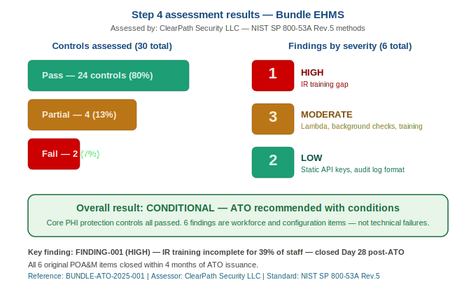
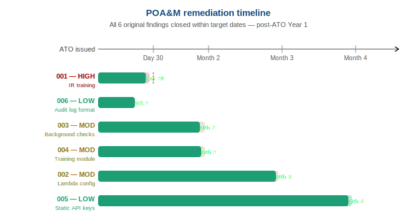

# Step 4 — Assess

---

## What is the Assess Step?

This is the security exam for Bundle. An **independent assessor** tests whether the controls documented in the SSP are actually working as described.

The Assess step produces three key outputs:

| Document | Purpose |
|----------|---------|
| **Security Assessment Plan (SAP)** | Agreed scope, schedule, and rules of engagement — written before testing begins |
| **Security Assessment Report (SAR)** | Results of the assessment — what passed, what failed, and why |
| **Plan of Action & Milestones (POA&M)** | The remediation tracker — every finding, who owns it, and when it will be fixed |

> These three documents, combined with the SSP from Step 3, form the **authorization package** that goes to the Authorizing Official in Step 5.

---

## Documents in This Folder

| File | Description |
|------|-------------|
| [README.md](README.md) | This file — overview of the Assess step and all findings |
| [security-assessment-plan.md](security-assessment-plan.md) | SAP — scope, team, schedule, and rules of engagement |
| [security-assessment-report.md](security-assessment-report.md) | Full SAR — 6 findings and 24 passed controls |
| [poam.md](poam.md) | Plan of Action and Milestones — all findings tracked |

## Assessment Overview

| Field | Value |
|-------|-------|
| Assessment Organisation | ClearPath Security LLC (External — Independent) |
| Lead Assessor | Sarah Chen |
| Technical Assessor | David Osei |
| Privacy Assessor | Dr. Amara Diallo |
| Assessment Standard | NIST SP 800-53A Rev. 5 |
| Controls Assessed | 30 system-specific and hybrid controls |
| Overall Result | **CONDITIONAL** — suitable for ATO with POA&M conditions |

---

## The Three Assessment Methods

Every control was tested using one or more of these NIST-defined methods:

| Method | What it means | Example |
|--------|--------------|---------|
| **Examine** | Review documentation, configs, and records | Reviewing quarterly account review logs |
| **Interview** | Speak with responsible personnel | Asking the ISSO how account terminations are handled |
| **Test** | Directly interact with the system to verify behaviour | Attempting 6 failed logins to confirm account lockout triggers |

---

## Assessment Results Summary

| Metric | Value |
|--------|-------|
| Total Controls Assessed | 30 |
| ✅ Pass | 24 (80%) |
| 🔄 Partial Pass | 4 (13%) |
| ❌ Fail | 2 (7%) |
| 🔴 HIGH Severity Findings | 1 |
| 🟠 MODERATE Severity Findings | 3 |
| 🟡 LOW Severity Findings | 2 |
| ℹ️ Informational Observations | 3 (no POA&M required) |

---

## Security Assessment Findings

### 🔴 FINDING-001 — Incident Response Training Not Completed (HIGH)
**Control:** IR-2 / IR-8 | **Method:** Interview + Examine | **Status:** Open → POA&M-001

Only 61% of Bundle staff (307 of 500) have completed mandatory annual IR awareness training. This includes 24 doctors and 37 nurses with clinical PHI access. Staff who have not completed training may not recognise or correctly report a security incident, directly increasing the window of a PHI breach. Under HIPAA (45 CFR 164.308(a)(5)), failure to train workforce members with PHI access is a direct Security Rule violation.

**Recommendation:** Complete training for all 193 outstanding staff within 30 days. Implement automated reminder and escalation process.

---

### 🟠 FINDING-002 — Lambda Functions Not in Configuration Baseline (MODERATE)
**Control:** CM-6 | **Method:** Examine + Test | **Status:** Open → POA&M-002

AWS Config rules cover core infrastructure (EC2, RDS, S3, IAM) but four Lambda functions are not covered. These functions have S3 and CloudWatch access and may contain insecure settings not yet identified.

**Recommendation:** Extend AWS Config coverage to all Lambda functions within 60 days. Review Lambda IAM execution roles for least privilege.

---

### 🟠 FINDING-003 — Background Checks Incomplete for 12 Staff (MODERATE)
**Control:** PS-3 | **Method:** Examine + Interview | **Status:** Open → POA&M-003

12 staff hired before the current background check policy have not had retrospective checks. 9 of these have PHI access. No evidence of malicious activity, but gap exists against HIPAA workforce vetting requirements.

**Recommendation:** Complete retrospective background checks for all 12 staff within 45 days. Prioritise the 9 with PHI access.

---

### 🟠 FINDING-004 — Online Security Training Module Incomplete (MODERATE)
**Control:** AT-2 | **Method:** Examine | **Status:** In Progress → POA&M-004

The online training module is still under development. Current in-person delivery lacks automated completion tracking and consistent content delivery, making HIPAA audit evidence difficult to produce.

**Recommendation:** Complete and deploy the online module within 60 days. Migrate all 500 staff to the tracked online platform.

---

### 🟡 FINDING-005 — API Service Accounts Use Static Keys (LOW)
**Control:** AC-11 | **Method:** Test | **Status:** Open → POA&M-005

Three Lambda integration service accounts use static long-lived API keys instead of IAM Roles with time-limited STS credentials. If a static key is ever compromised, access persists until manually rotated.

**Recommendation:** Migrate to IAM execution roles with temporary STS credentials within 90 days.

---

### 🟡 FINDING-006 — Audit Review Log Lacks Structured Format (LOW)
**Control:** AU-6 | **Method:** Examine | **Status:** Open → POA&M-006

Weekly audit reviews are being conducted correctly but documented in unstructured free-text. This makes completeness verification difficult during future assessments.

**Recommendation:** Develop and implement a structured review log template within 30 days.

---

## Controls That Passed Assessment

| Control | Name | Result | Methods |
|---------|------|--------|---------|
| AC-2 | Account Management | ✅ Pass | Examine, Interview, Test |
| AC-3 | Access Enforcement (RBAC) | ✅ Pass | Test |
| AC-6 | Least Privilege | ✅ Pass | Examine |
| AC-7 | Login Attempt Limits | ✅ Pass | Test |
| AC-11 | Session Lock (human sessions) | 🔄 Partial | Test |
| AC-17 | Remote Access | ✅ Pass | Examine, Test |
| AU-2 | Event Logging | ✅ Pass | Examine, Test |
| AU-9 | Audit Record Protection | ✅ Pass | Examine, Test |
| AU-11 | Audit Record Retention | ✅ Pass | Examine |
| IA-2 | MFA — All Users | ✅ Pass | Test |
| IA-2(1) | MFA — Privileged Accounts | ✅ Pass | Examine, Test |
| IA-5 | Password Management | ✅ Pass | Examine, Test |
| SC-7 | Boundary Protection | ✅ Pass | Examine, Test |
| SC-8 | Transmission Encryption | ✅ Pass | Test |
| SC-28 | Encryption at Rest | ✅ Pass | Examine |
| IR-4 | Incident Handling | ✅ Pass | Examine, Interview |
| IR-6 | Incident Reporting | ✅ Pass | Examine, Interview |
| IR-8 | Incident Response Plan | ✅ Pass | Examine |
| SI-2 | Flaw Remediation | ✅ Pass | Examine |
| SI-3 | Malware Protection | ✅ Pass | Examine, Test |
| SI-4 | System Monitoring | ✅ Pass | Examine |
| CP-9 | System Backup | ✅ Pass | Examine, Test |
| CP-10 | System Recovery | ✅ Pass | Examine |
| RA-5 | Vulnerability Scanning | ✅ Pass | Examine |

---

## Plan of Action and Milestones (POA&M)

### POA&M-001 — IR Training Gap
**Risk:** 🔴 HIGH | **Owner:** James Okafor (ISSO) | **Due:** 30 days from ATO | **Status:** Open

**Finding:** 193 of 500 staff have not completed mandatory IR awareness training including 24 doctors and 37 nurses with PHI access. Direct HIPAA violation.

**Corrective Action:**
1. Identify all outstanding staff (Week 1)
2. Issue formal completion notice with 21-day deadline to staff and department heads (Week 1)
3. Enable automated weekly reminders (Week 2)
4. Escalate to System Owner for non-completions at 21 days (Week 3)
5. Confirm 100% completion and provide evidence to AO (Week 4)

**Resources:** LMS platform (available). ~4 hours ISSO time. No additional budget.

---

### POA&M-002 — Lambda Configuration Baseline Gap
**Risk:** 🟠 MODERATE | **Owner:** Priya Nair (ISSE) | **Due:** 60 days from ATO | **Status:** Open

**Finding:** 4 Lambda functions (backup-verifier, log-exporter, report-generator, health-checker) not covered by AWS Config rules.

**Corrective Action:**
1. Audit Lambda IAM execution roles (Weeks 1-2)
2. Develop custom AWS Config rules for Lambda coverage (Weeks 2-4)
3. Deploy rules and remediate findings (Weeks 4-6)
4. Update SSP CM-6 implementation statement (Weeks 6-8)

**Resources:** ~12 hours ISSE time. No additional budget.

---

### POA&M-003 — Background Checks Incomplete
**Risk:** 🟠 MODERATE | **Owner:** Marcus Webb (Privacy Officer) | **Due:** 45 days from ATO | **Status:** Open

**Finding:** 12 staff hired before current policy have no background check on record. 9 have PHI access.

**Corrective Action:**
1. Confirm background check provider and process (Week 1)
2. Prioritise 9 PHI-access staff for immediate screening (Weeks 1-3)
3. Complete remaining 3 administrative staff checks (Weeks 3-6)
4. Update HR onboarding policy (Weeks 5-6)

**Resources:** ~$900 estimated vendor cost (12 checks). ~6 hours Privacy Officer time.

---

### POA&M-004 — Security Training Module Incomplete
**Risk:** 🟠 MODERATE | **Owner:** James Okafor (ISSO) | **Due:** 60 days from ATO | **Status:** In Progress

**Finding:** Online training module under development. Current in-person delivery lacks automated tracking.

**Corrective Action:**
1. Complete 3 outstanding training modules (Weeks 1-3)
2. QA review by System Owner and Privacy Officer (Weeks 3-4)
3. Deploy to all 500 staff via LMS (Week 4)
4. Confirm 100% completion (Weeks 6-7)

**Resources:** LMS platform (available). ~20 hours ISSO time.

---

### POA&M-005 — API Service Account Static Keys
**Risk:** 🟡 LOW | **Owner:** Priya Nair (ISSE) | **Due:** 90 days from ATO | **Status:** Open

**Finding:** 3 Lambda service accounts use static long-lived API keys instead of IAM role-based temporary credentials.

**Corrective Action:**
1. Identify 3 Lambda functions using static keys (Week 1)
2. Create IAM execution roles with equivalent permissions (Weeks 2-3)
3. Update Lambda config to use IAM roles (Weeks 3-4)
4. Test all functions with new credentials (Week 4)
5. Revoke and delete static keys (Weeks 4-5)

**Resources:** ~8 hours ISSE time. No additional budget.

---

### POA&M-006 — Audit Review Log Format
**Risk:** 🟡 LOW | **Owner:** James Okafor (ISSO) | **Due:** 30 days from ATO | **Status:** Open

**Finding:** Weekly audit reviews documented in unstructured free-text — difficult to verify completeness.

**Corrective Action:**
1. Design structured review log template with activity checklist and sign-off (Week 1)
2. Get System Owner approval (Weeks 1-2)
3. Implement for all future reviews (Week 2)
4. Backfill template for previous 3 months (Weeks 2-4)

**Resources:** ~3 hours ISSO time. No additional tools or budget.

---

## Assessor Conclusion

> ClearPath Security LLC concludes that Bundle EHMS demonstrates a commendable security posture for a HIGH impact healthcare system. Core technical controls — encryption, access control, network boundary protection, monitoring, and backup — are robustly implemented. Identified findings are primarily in workforce management and configuration completeness, not in core technical controls.
>
> **Bundle is suitable for ATO issuance** subject to the AO reviewing and accepting the six POA&M findings, with particular attention to FINDING-001 (IR training). The AO should set a condition requiring IR training completion for all staff within 30 days of ATO issuance.

---

## Assess Step Checklist

| Task | NIST Task ID | Status |
|------|-------------|--------|
| SAP developed and approved before assessment | A-1 | ✅ Complete |
| Assessment conducted by independent third party | A-2 | ✅ Complete |
| All controls assessed using NIST 800-53A methods | A-3 | ✅ Complete |
| SAR produced with findings and recommendations | A-4 | ✅ Complete |
| All findings assigned severity ratings | A-5 | ✅ Complete |
| POA&M entries created with owners and target dates | A-6 | ✅ Complete |
| AO briefed on results before authorization decision | A-7 | ✅ Complete |
| Assessment package compiled (SAP + SAR + POA&M) | A-8 | ✅ Complete |

---

## Next Step

With the assessment complete and the POA&M established, the project moves to **Step 5 — Authorize**.

The Authorizing Official will review the complete authorization package (SSP + SAR + POA&M), evaluate residual risk, and decide whether to issue the **Authorization to Operate (ATO)**.

➡️ [Go to Step 5 — Authorize](../05-authorize/README.md)
⬅️ [Back to Step 3 — Implement](../03-implement/README.md)

---

## Document Information

| Field | Value |
|-------|-------|
| Document Version | 1.0 |
| Assessment Standard | NIST SP 800-53A Rev. 5 |
| Conducted By | ClearPath Security LLC |
| POA&M Maintained By | James Okafor, ISSO |
| NIST Reference | NIST SP 800-37 Rev. 2 — Assess Step |

---

*This document is part of the Bundle RMF portfolio project. All names, data, and scenarios are fictional and used for learning and career development purposes only.*

