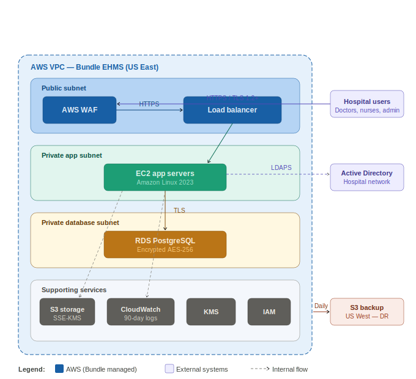
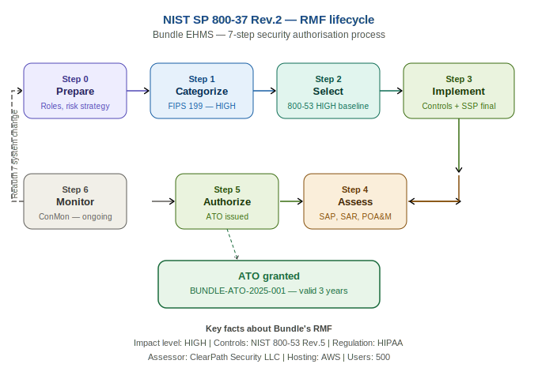
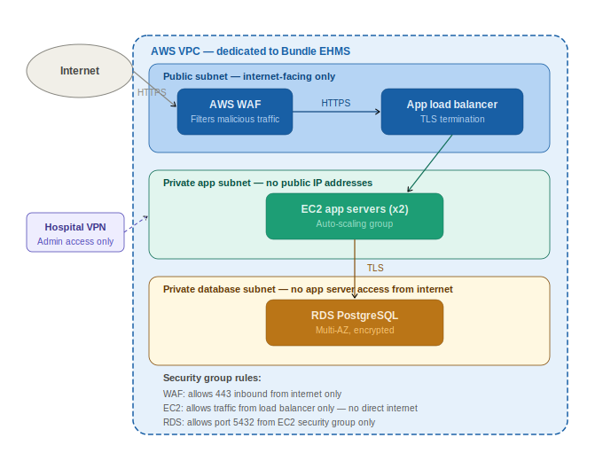

   # Bundle RMF Project


---

## About This Project

This repository demonstrates a complete, end-to-end implementation of the **NIST Risk Management Framework (NIST SP 800-37 Revision 2)** applied to a fictional Electronic Healthcare Management System called **Bundle**.

Every step of the RMF lifecycle is documented — from the initial preparation and role assignment through to the Authorization to Operate and an active Year-One continuous monitoring programme. The project is designed to simulate the documentation, decisions, and artefacts produced in a real-world healthcare security programme.

> **This is a portfolio and learning project.** All names, system details, and scenarios are fictional. Bundle does not exist. No real patient data is used anywhere in this repository.

---

## About Bundle


**Bundle** is a fictional cloud-based Electronic Healthcare Management System (EHMS) serving approximately 500 clinical and administrative staff across a mid-sized hospital network. It acts as the central platform for all clinical and administrative operations — managing Electronic Health Records (EHR), patient scheduling, medication tracking, insurance billing, and staff access control.

Bundle is hosted entirely on **Amazon Web Services (AWS)** using EC2, RDS (PostgreSQL), S3, CloudWatch, IAM, KMS, and WAF. It processes highly sensitive **Protected Health Information (PHI)** and is subject to **HIPAA** and **HITECH** regulations.

Bundle is formally categorised as a **HIGH impact system** under FIPS 199, meaning it requires the most rigorous level of security controls available under the NIST SP 800-53 framework.

| Field | Value |
|-------|-------|
| System Name | Bundle — Electronic Healthcare Management System |
| System Identifier | BUNDLE-EHMS-001 |
| Hosting | AWS (EC2, RDS, S3, CloudWatch, IAM, KMS, WAF) |
| Users | ~500 (doctors, nurses, administrators, billing staff) |
| Data | PHI, PII, billing records, scheduling data |
| Impact Level | **HIGH** (Confidentiality: HIGH, Integrity: HIGH, Availability: MODERATE) |
| Regulation | HIPAA Security Rule, HITECH Act |
| ATO Status | **GRANTED** — BUNDLE-ATO-2025-001 (valid 2025–2028) |







---

## RMF Progress Tracker

| Step | Name | Key Output | Status |
|------|------|------------|--------|
| [Step 0](./00-prepare/README.md) | **Prepare** | Roles assigned, risk strategy, preliminary threat assessment | ✅ Complete |
| [Step 1](./01-categorize/README.md) | **Categorize** | FIPS 199 — HIGH impact rating, system boundary, data flow | ✅ Complete |
| [Step 2](./02-select/README.md) | **Select** | NIST 800-53 HIGH baseline selected, tailored, SSP draft | ✅ Complete |
| [Step 3](./03-implement/README.md) | **Implement** | 25 control implementation statements, evidence folder, SSP final | ✅ Complete |
| [Step 4](./04-assess/README.md) | **Assess** | SAP, SAR, 6 findings (1 HIGH, 3 MODERATE, 2 LOW), POA&M | ✅ Complete |
| [Step 5](./05-authorize/README.md) | **Authorize** | Risk acceptance memo, ATO letter issued — BUNDLE-ATO-2025-001 | ✅ Complete |
| [Step 6](./06-monitor/README.md) | **Monitor** | ConMon strategy, 12 scan reports, 4 quarterly posture reports | ✅ Active |

---

## Repository Structure

```
bundle-rmf-project/
│
├── 00-prepare/
│   ├── README.md                          ← Step overview and role assignments
│   ├── roles-and-responsibilities.md      ← RMF role assignments + RACI matrix
│   ├── risk-management-strategy.md        ← Risk tolerance, assessment approach
│   ├── mission-and-business-context.md    ← Why Bundle exists, critical functions
│   ├── preliminary-risk-assessment.md     ← High-level threat assessment
│   └── applicable-laws-and-standards.md  ← HIPAA, HITECH, NIST publications
│
├── 01-categorize/
│   ├── README.md                          ← Step overview + FIPS 199 results
│   ├── system-description.md             ← Full system description
│   ├── information-types.md              ← PHI, PII, billing, operational data
│   ├── fips199-impact-analysis.md        ← Formal categorization (HIGH)
│   ├── system-boundary.md               ← In-scope, inherited, third-party
│   ├── hardware-software-inventory.md   ← AWS services + software versions
│   ├── data-flow-description.md         ← 7 primary data flows
│   └── data-flow-diagram.png            ← Visual architecture diagram
│
├── 02-select/
│   ├── README.md                         ← Step overview + control tables
│   ├── control-selection.md             ← All 20 families documented
│   ├── tailoring-decisions.md           ← 8 tailoring decisions with justification
│   ├── inherited-controls.md            ← AWS inherited controls + evidence sources
│   ├── system-security-plan-draft.md    ← SSP draft — structure and completed sections
│   └── control-responsibility-matrix.md ← RACI for all controls
│
├── 03-implement/
│   ├── README.md                              ← Step overview + all implementation statements
│   ├── control-implementation-statements.md  ← Detailed statements for all 25 controls
│   ├── system-security-plan-final.md         ← Complete SSP — all 10 sections
│   ├── implementation-status-tracker.xlsx    ← Control status tracker
│   └── evidence/
│       ├── AC/       ← Access Control evidence
│       ├── AU/       ← Audit and Accountability evidence
│       ├── IA/       ← Identity and Authentication evidence
│       ├── SC/       ← System and Communications evidence
│       ├── IR/       ← Incident Response evidence
│       ├── SI/       ← System Integrity evidence
│       ├── CP/       ← Contingency Planning evidence
│       ├── RA/       ← Risk Assessment evidence
│       ├── aws-compliance/  ← AWS SOC 2, ISO 27001, HIPAA BAA
│       └── policies/        ← All security policies
│
├── 04-assess/
│   ├── README.md                      ← Step overview, all findings, full POA&M
│   ├── security-assessment-plan.md   ← SAP — scope, team, schedule, rules of engagement
│   ├── security-assessment-report.md ← Full SAR with 6 findings + 24 passed controls
│   ├── poam.md                       ← Plan of Action and Milestones
│   └── assessment-evidence-log.md   ← Log of methods used per control
│
├── 05-authorize/
│   ├── README.md                        ← Full authorization package + ATO letter
│   ├── authorization-package-index.md  ← Index of documents submitted to AO
│   ├── risk-executive-summary.md       ← Plain-English posture summary for AO
│   ├── risk-acceptance-memo.md         ← AO's formal risk acceptance
│   ├── ato-letter.md                   ← Signed ATO letter (BUNDLE-ATO-2025-001)
│   ├── privacy-impact-assessment.md   ← HIPAA privacy compliance review
│   └── ato-conditions-tracker.md      ← Live ATO conditions compliance tracker
│
├── 06-monitor/
│   ├── README.md                        ← Full ConMon programme + Year-One results
│   ├── continuous-monitoring-strategy.md ← 15 activities, frequencies, thresholds
│   ├── scan-reports/                   ← Monthly vulnerability scan summaries
│   ├── poam-updates.md                 ← Living POA&M with all status updates
│   ├── quarterly-posture-reports/      ← Q1–Q4 reports submitted to AO
│   ├── change-management-log.md        ← System change records + security assessments
│   ├── audit-review-log.md             ← Structured weekly audit review records
│   └── conmon-metrics-dashboard.md     ← Year-one monitoring metrics
│
└── diagrams/
    ├── bundle-system-architecture.png  ← Full AWS architecture diagram
    ├── rmf-lifecycle-overview.png      ← 7-step RMF flow diagram
    └── network-topology.png            ← VPC, subnets, and security boundaries
```

---

## Key Documents — Quick Access

| Document | Description | Link |
|----------|-------------|------|
| System Security Plan (Final) | Master security document — all 10 sections | [SSP Final](./03-implement/system-security-plan-final.md) |
| FIPS 199 Categorization | Formal HIGH impact rating with justification | [FIPS 199](./01-categorize/fips199-impact-analysis.md) |
| Control Selection | All 20 NIST 800-53 families with tailoring decisions | [Controls](./02-select/control-selection.md) |
| Security Assessment Report | Full SAR — 6 findings, 24 passed controls | [SAR](./04-assess/security-assessment-report.md) |
| POA&M | All findings with owners, deadlines, and status | [POA&M](./04-assess/poam.md) |
| ATO Letter | Authorization to Operate — BUNDLE-ATO-2025-001 | [ATO](./05-authorize/ato-letter.md) |
| ConMon Strategy | 15 monitoring activities with thresholds | [ConMon](./06-monitor/continuous-monitoring-strategy.md) |

---

## RMF Roles — Bundle Hospital Network

| Role | Name | Title |
|------|------|-------|
| Authorizing Official (AO) | Linda Reyes | Chief Information Officer |
| System Owner | Dr. Sarah Mitchell | Chief Medical Officer |
| ISSO | James Okafor | IT Security Manager |
| ISSE | Priya Nair | Senior Cloud Security Engineer |
| Control Assessor | ClearPath Security LLC | External Assessment Organisation |
| Privacy Officer | Marcus Webb | Chief Privacy Officer |
| Common Control Provider | AWS Security Team | Amazon Web Services |

> All names are fictional and used for portfolio simulation purposes only.

---

## Security Highlights

### What is implemented and working

- **Multi-Factor Authentication** enforced for all 500 users via AWS Cognito. Hardware tokens required for privileged accounts.
- **End-to-end encryption** — AES-256 at rest (AWS KMS), TLS 1.2+ in transit. No unencrypted storage anywhere in the environment.
- **Layered network security** — dedicated AWS VPC with WAF, private subnets for application and database servers, no direct internet access to backend systems.
- **Continuous threat detection** — AWS GuardDuty ML-based detection active across CloudTrail, VPC Flow Logs, and DNS. CrowdStrike Falcon EDR on all EC2 instances.
- **Comprehensive audit trail** — all user actions, record access, and administrative events logged to CloudWatch with 90-day active retention and 12-month archive.
- **Tested recovery capability** — daily cross-region backups, RTO 4 hours confirmed in DR test.

### What the assessment found

The independent assessment by ClearPath Security LLC identified **6 findings** — none of which represented a fundamental failure of PHI protection. All findings were workforce and configuration items:

| Finding | Severity | Resolution |
|---------|----------|------------|
| IR training incomplete for 39% of staff | 🔴 HIGH | Closed Day 28 — 100% completion confirmed |
| Lambda functions outside Config baseline | 🟠 MODERATE | Closed Month 3 — Config rules deployed |
| 12 staff without background checks | 🟠 MODERATE | Closed Month 2 — all checks complete |
| Online training module incomplete | 🟠 MODERATE | Closed Month 2 — module deployed |
| 3 service accounts using static API keys | 🟡 LOW | Closed Month 4 — IAM roles deployed |
| Audit review log unstructured | 🟡 LOW | Closed Month 1 — template implemented |

**All 6 original POA&M items closed within 4 months of ATO issuance.**

---

## Frameworks and Standards Used

| Standard | Purpose in This Project |
|----------|------------------------|
| NIST SP 800-37 Rev. 2 | The RMF process — all 7 steps |
| NIST SP 800-53 Rev. 5 | Security control catalogue — HIGH baseline |
| NIST SP 800-53A Rev. 5 | Assessment procedures used by ClearPath Security LLC |
| NIST SP 800-137 | Continuous monitoring guidance |
| NIST SP 800-60 Vol. I & II | Information type classification guidance |
| FIPS 199 | Security categorization standard |
| FIPS 200 | Minimum security requirements |
| HIPAA Security Rule | Healthcare data protection requirements |
| HITECH Act | Strengthened HIPAA enforcement |
| AWS Shared Responsibility Model | Inherited control boundaries |

---

## Lessons Learned

A few things that are worth knowing if you are reading this as a learning project:

**Step 0 (Prepare) is the step most people skip — and it shows.** Without clear role assignments and a documented risk strategy, every subsequent step becomes harder. Do Step 0 properly and everything else has a foundation to build on.

**The SSP is not a one-time document.** It starts in Step 2 and lives through every step. Every implementation statement, every finding, every change feeds back into it. Treat it like a living document from Day 1.

**The POA&M is a sign of honesty, not failure.** A programme with zero POA&M entries either has no findings (extremely rare for a real system) or is not looking hard enough. A well-maintained POA&M with realistic timelines and genuine progress is one of the strongest signals of a mature security programme.

**The ATO is not the end.** The Monitor step is where most of the actual security work happens. An organization that gets the ATO and then does nothing until reauthorization three years later is not running a security programme — it is running a compliance exercise.

**The RMF is a cycle.** Every major change loops back to earlier steps. Every new finding requires assessment of whether it affects the authorization. The framework is designed to evolve with the system, not be completed once and filed away.

---

## Project Releases

| Tag | Description |
|-----|-------------|
| `v0.1-prepare-complete` | Step 0 — Prepare phase complete |
| `v0.2-categorize-complete` | Step 1 — System categorized as HIGH impact |
| `v0.3-select-complete` | Step 2 — HIGH baseline selected and tailored |
| `v0.4-implement-complete` | Step 3 — All controls implemented, SSP finalised |
| `v0.5-assess-complete` | Step 4 — Assessment complete, 6 findings, POA&M established |
| `v1.0-ATO-issued` | **Step 5 — ATO GRANTED — BUNDLE-ATO-2025-001** |
| `v1.1-year-one-complete` | Step 6 — Year-One ConMon programme complete, all POA&M closed |

---

## How to Navigate This Project

If you are an **employer or reviewer** looking at this project:

- Start here with the main README for the overview
- Go to [Step 1](./01-categorize/README.md) to see the FIPS 199 categorization with full justification
- Go to [Step 3](./03-implement/README.md) to see detailed control implementation statements
- Go to [Step 4](./04-assess/README.md) to see the full SAR and POA&M
- Go to [Step 5](./05-authorize/README.md) to see the ATO letter and risk acceptance memo

If you are a **learner** following this project as a study guide:

- Work through each step folder in order — 00 through 06
- Each README explains the step in plain English before the technical content
- The Word documents in each step contain more detailed explanations and callout boxes
- Pay particular attention to the SSP thread — it starts in Step 2 and runs through to Step 5

---

## Contact

This project was created as a cybersecurity portfolio piece demonstrating knowledge of the NIST Risk Management Framework in a healthcare context. It is intended to showcase skills in security documentation, risk assessment, control selection, and continuous monitoring programme design.

---

*All system names, personnel, and scenarios in this repository are entirely fictional. No real patient data, real organisation data, or real security vulnerabilities are disclosed anywhere in this project. Created for learning and career development purposes.*

